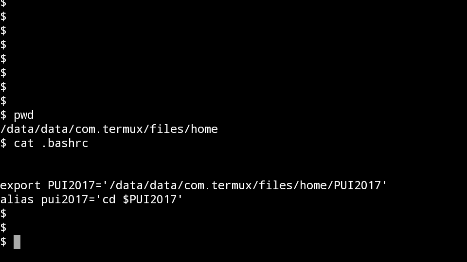

# PUI2017_as9788

For HW1_2 here are the steps that I took to setup the environment. 

First, I had to create a new directory name "PUI2017" on my machine by using the mkdir PUI2017 command. 

Next, to define a path to it and create an environmental variable, I set PUI2017 equal to the full path of this new directory (using the command pwd will yield the current path leading up to the current directory you are in). 

I saved this along with an 'export' infront of the PUI2017 equals path to directory inside my .bashrc file that is in my home directory. 

Next, I defined an alias right below that in order to take advantage of the PUI2017 variable by cd'ing into it. 

So to create the alias, I used 'alias pui2017' equals 'cd $PUI217'. The dollar sign is needed to deference the variable. 

Then I saved my .bashrc file by using the command :wq. Once I was back on the command line, I had to source the .bashrc file by runing the source command on the file so that the new settings would take effect (without having to login and logout). 

Finally, I ran the required pwd command (to show current working directory) then the alias pui2017 (which took me to the PUI2017 directory) and pwd once more to show the difference in the path and that the alias indeed changed directories. 

Please find the final snapshot that we were asked to take recording the pwd ; pui2017; pwd sequence below. 

A second screenshot which shows the contents of .bashrc follows as well.

 Thank you!  

